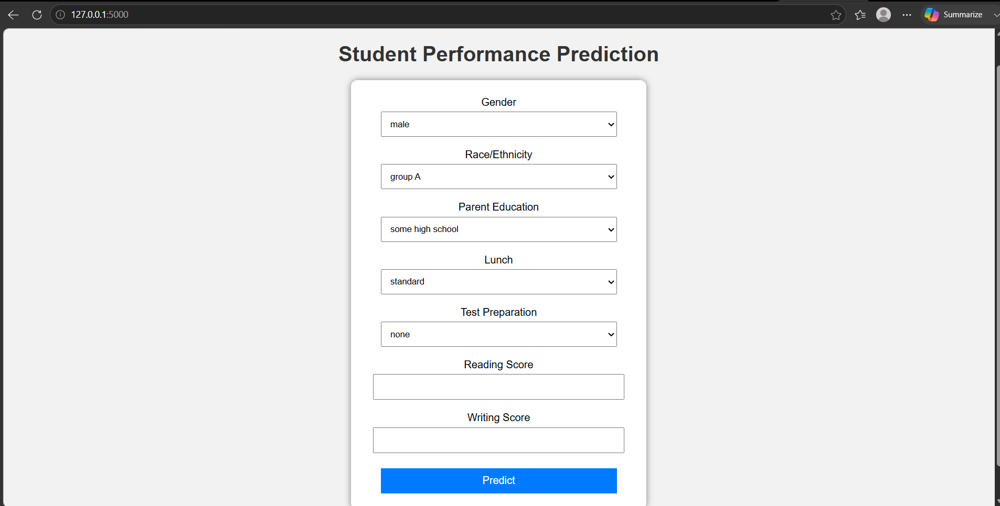
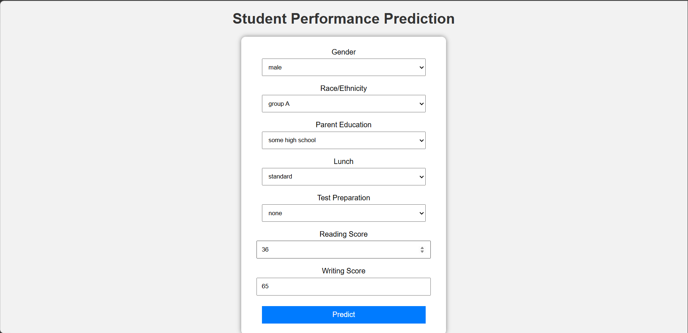
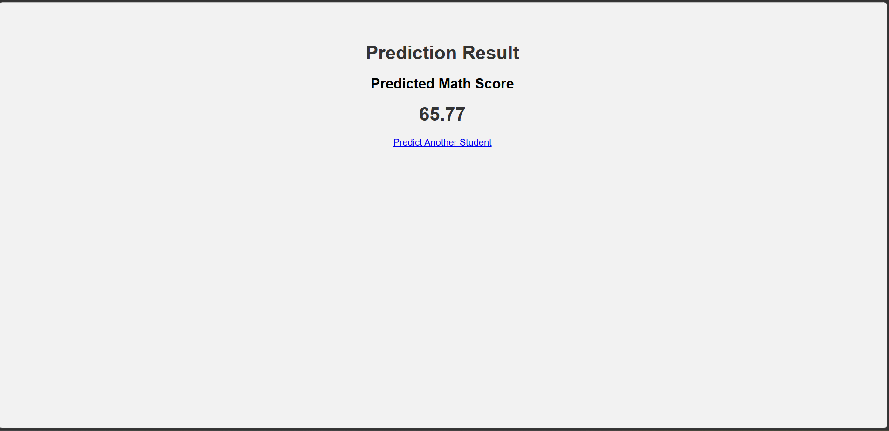
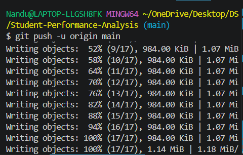

# 📊 Student Performance Analysis and Prediction

A Machine Learning and Flask-based web application that predicts a student's Mathematics score based on demographic and academic information. The project also includes Exploratory Data Analysis (EDA) of the Students Performance dataset.

---

# 📷 Project Screenshots

## 🏠 Home Page



---

## 📝 Prediction Form



---

## 🎯 Prediction Result



---

## 📈 Exploratory Data Analysis



---

# 🚀 Features

- Exploratory Data Analysis (EDA)
- Data Visualization
- Machine Learning Prediction
- Random Forest Regression
- Flask Web Application
- Responsive User Interface

---

# 🛠 Technologies Used

- Python
- Flask
- Pandas
- NumPy
- Scikit-learn
- Matplotlib
- Seaborn
- HTML5
- CSS3
- Joblib

---

# 📂 Project Structure

```text
Student-Performance-Analysis/

│
├── dataset/
│   └── StudentsPerformance.csv
│
├── images/
│   ├── home.png
│   ├── input.png
│   ├── prediction.png
│   └── eda.png
│
├── model/
│   └── student_model.pkl
│
├── notebooks/
│   └── Student_Analysis.ipynb
│
├── static/
│   └── style.css
│
├── templates/
│   ├── index.html
│   └── result.html
│
├── app.py
├── train_model.py
├── requirements.txt
└── README.md
```

---

# 📚 Dataset

The project uses the **StudentsPerformance.csv** dataset.

Features:

- Gender
- Race/Ethnicity
- Parental Level of Education
- Lunch Type
- Test Preparation Course
- Reading Score
- Writing Score
- Math Score

---

# 🤖 Machine Learning Model

Algorithm Used:

- Random Forest Regressor

Input Features:

- Gender
- Race/Ethnicity
- Parental Education
- Lunch Type
- Test Preparation Course
- Reading Score
- Writing Score

Output:

- Predicted Mathematics Score

---

# 📊 Exploratory Data Analysis

The notebook includes:

- Data Cleaning
- Missing Value Analysis
- Duplicate Check
- Statistical Summary
- Distribution Plots
- Box Plots
- Correlation Heatmap
- Pair Plot
- Gender-wise Analysis
- Lunch-wise Analysis
- Test Preparation Analysis

---

# ⚙️ Installation

Install the required libraries:

```bash
pip install -r requirements.txt
```

Train the model:

```bash
python train_model.py
```

Run the Flask application:

```bash
python app.py
```

Open the browser:

```
http://127.0.0.1:5000
```

---

# 🔮 Future Enhancements

- Predict Reading Score
- Predict Writing Score
- Dashboard with Charts
- Multiple ML Algorithms
- Database Integration
- Cloud Deployment

---

# 👨‍💻 Author

**Nandu**

B.Tech Computer Science and Engineering

Machine Learning Mini Project

---

# 📄 License

This project is developed for educational purposes.